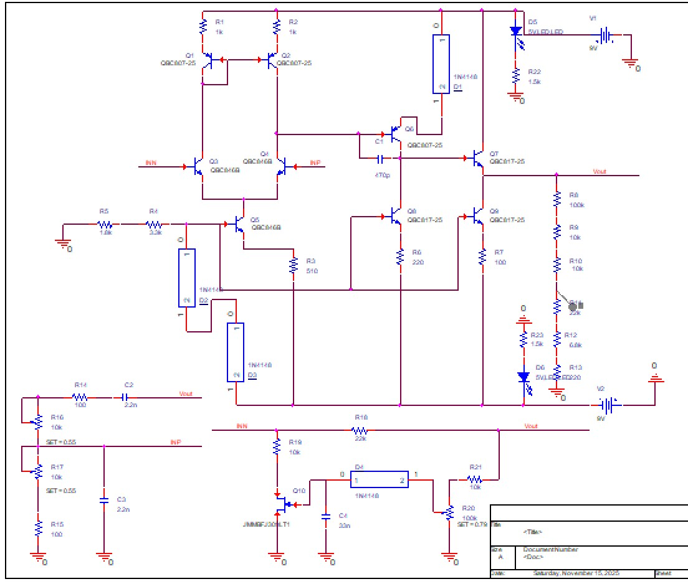
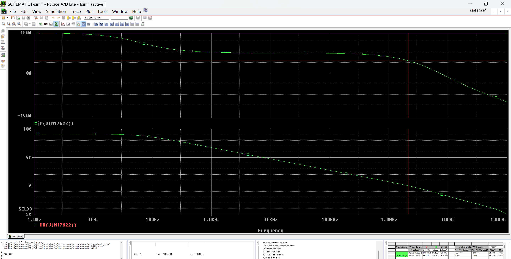
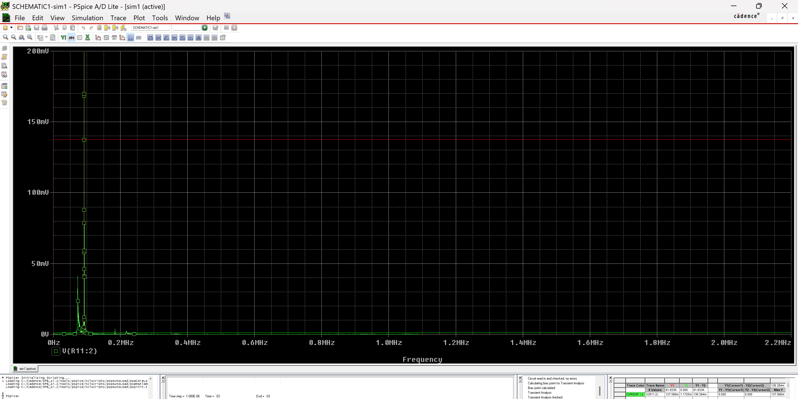
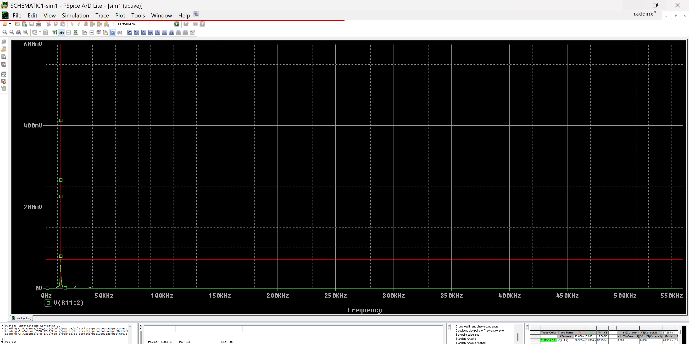
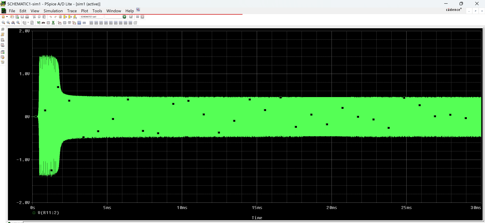
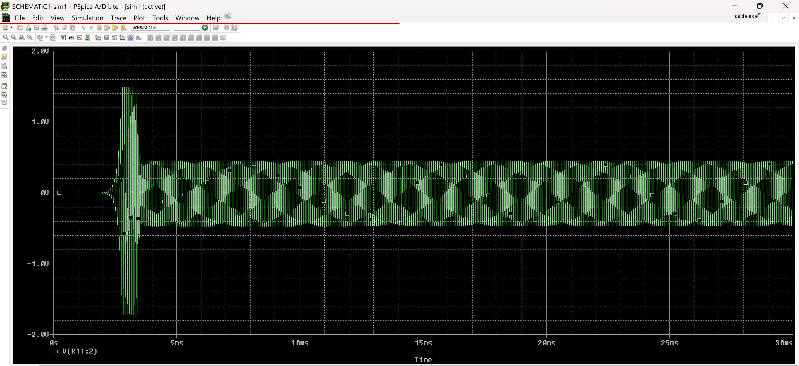
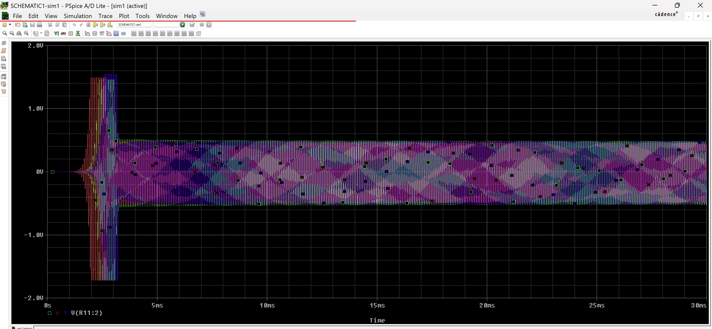
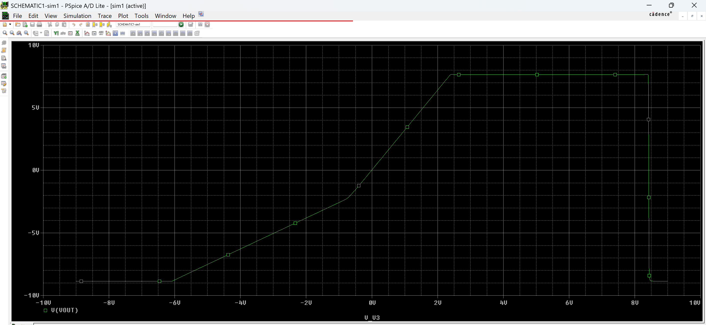
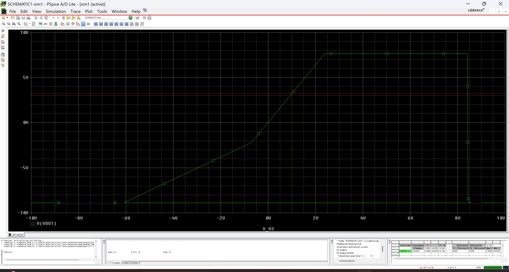
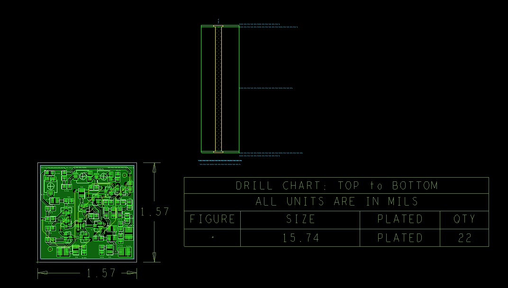

# Wien Bridge Oscillator

Design and simulation of an RC Wien Bridge Oscillator using OrCAD and PSpice.

## Description

This project presents the design and simulation of a Wien Bridge Oscillator circuit.
The oscillator generates a sinusoidal signal and allows frequency adjustment within a specified range.
The circuit was designed and simulated using OrCAD and includes analysis of frequency response, transient behavior, DC sweep and temperature variation.

## Design Specifications

* Adjustable oscillation frequency: **14.5 – 87 kHz**
* Output load: **RL = 29 kΩ**
* Output oscillation amplitude: **0.46 V**
* Automatic amplitude control using **JFET**
* Operating temperature range: **0°C – 70°C**
* Power supply presence indicated using **LED**

## Circuit Schematic

## Block Diagram

## Frequency Response

Maximum frequency:

Minimum frequency:

## Transient Analysis

Maximum frequency transient response:

Minimum frequency transient response:

## Temperature Analysis

## DC Sweep Analysis

## Amplification Stage

## PCB Layout

## Tools Used

* OrCAD Capture
* PSpice Simulation

## Author

Vaicar Stefania-Andreea
Electronics and Telecommunications Student
University POLITEHNICA of Bucharest
